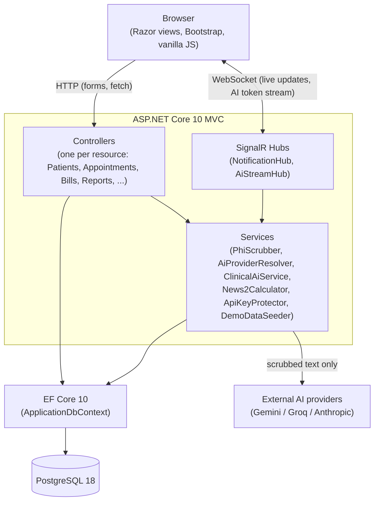
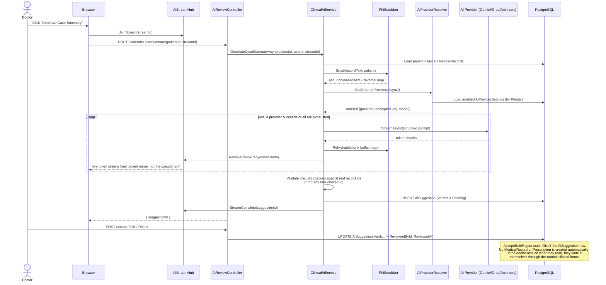
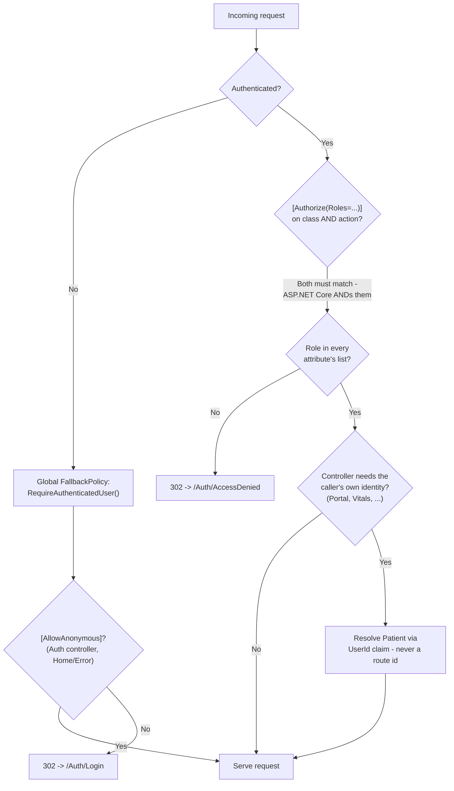

# Architecture

Three diagrams: the overall layering, the AI spine's actual request/response sequence, and the
authorization model. All three are traced from the running code, not idealized.

## 1. Layers

Every controller talks to `ApplicationDbContext` directly for straightforward CRUD — there is no
repository layer, which is a deliberate scope decision, not an oversight: with one DbContext and no
second data source, a repository would only add indirection. The `Services/` layer exists for logic
that either has real business rules (`News2Calculator`, `PhiScrubber`), coordinates multiple
concerns (`ClinicalAiService`), or is cross-cutting (`ApiKeyProtector`, `DemoDataSeeder`).

## 2. The AI spine — end-to-end sequence

This is the flow behind the "Generate Case Summary" button on a patient's chart, traced from
`Services/ClinicalAiService.cs`, `Controllers/AiReviewController.cs`, and `Hubs/AiStreamHub.cs`.
The critical property it's designed to demonstrate: **the AI never writes to a clinical table.**
It produces exactly one thing — an `AiSuggestion` row — and every path out of that row back into
clinical data requires a human action taken through the *ordinary* clinical forms, not an
automated conversion.

Two details worth being able to explain unprompted:

- **Rehydration runs over the full raw buffer every time**, not a truncated prefix — a pseudonym
  occurrence can straddle a streaming chunk boundary, and `Replace` needs every character of a
  match to recognize it. What's withheld from the browser instead is a trailing margin of output
  characters sized to the longest pseudonym in play, so a match that's still incomplete can never
  cause already-sent text to be silently wrong.
- **Provider fallback is a priority-ordered list, not a hardcoded pair.** `AiProviderResolver`
  reads `AiProviderSettings` (admin-managed, encrypted keys) in priority order; the first provider
  gets one retry on a transient failure, every other provider in the chain gets one attempt before
  the service gives up and reports "all providers unavailable." Adding a new vendor is
  `IAiTextProvider` + a DI registration — no branching on provider type anywhere else.

## 3. Authorization model

Three things this diagram is standing in for:

- **The fallback policy inverts the framework default.** ASP.NET Core is opt-in by default — a
  controller with no `[Authorize]` is anonymous. `Program.cs` sets a global `FallbackPolicy` of
  `RequireAuthenticatedUser()`, so the default flips to opt-out: every endpoint requires a signed-in
  user unless explicitly marked `[AllowAnonymous]`. Before this existed, `StaffController` and
  `MedicinesController` were reachable by an anonymous `GET` — confirmed live, not theoretical.
- **Stacked `[Authorize(Roles=...)]` attributes are ANDed, not overridden.** A class-level
  attribute of `Doctor,Pharmacist,Admin` and a method-level attribute adding `Patient` do **not**
  combine into a wider set — the method's attribute is evaluated in addition to the class's, so
  `Patient` is still excluded unless the class-level attribute itself is widened. This surfaced as
  a real bug while building the patient portal (`PrescriptionsController.Print` kept 302-ing a
  patient trying to print their own prescription) and is now the reason narrowing happens with
  *extra* per-action attributes added to an already-wide class attribute, never the reverse.
- **Role membership is necessary but not sufficient for patient-scoped data.** `[Authorize(Roles =
  "Patient")]` proves the caller is *a* patient, not *which* patient. `PortalController` (and
  `VitalsController`'s appointment lookups) resolve the actual `Patient` row from the `UserId`
  claim set at login (`AuthController.SignInUserAsync`) on every single action, and every query is
  then scoped to that patient's own `Id`. A route or query-string `id` is never trusted for
  ownership — see the IDOR walkthrough in
  [DEFENSE-NOTES.md](DEFENSE-NOTES.md#anticipated-questions).
