# Entity-Relationship Diagram

All 18 tables in the schema, derived directly from `Models/ApplicationDbContext.cs`
(`OnModelCreating`) and each model's `[ForeignKey]` attributes — not from naming convention,
since several foreign keys use non-conventional names that EF's default convention wouldn't
infer on its own (see [Notable relationships](#notable-relationships) below).

```mermaid
erDiagram
    ROLE ||--o{ USER : "has many"
    USER ||--o| USER : "assigned doctor (Assistant/Patient -> Doctor)"

    USER ||--o{ PATIENT : "registers (optional, front desk)"
    USER ||--o| PATIENT : "portal login (optional, one-to-one)"

    PATIENT ||--o{ ADMISSION : "has"
    USER ||--o{ ADMISSION : "admits (doctor)"
    ADMISSION ||--o{ BEDTRANSFER : "has"
    BED ||--o{ BEDTRANSFER : "assigned via"

    PATIENT ||--o{ APPOINTMENT : "books"
    USER ||--o{ APPOINTMENT : "sees (doctor)"
    APPOINTMENT ||--o| PATIENTVITAL : "vitals for (optional)"
    APPOINTMENT ||--o{ MEDICALRECORD : "documented in (optional)"

    PATIENT ||--o{ PATIENTVITAL : "has"
    USER ||--o{ PATIENTVITAL : "records (assistant)"

    PATIENT ||--o{ MEDICALRECORD : "has"
    USER ||--o{ MEDICALRECORD : "writes (doctor)"

    PATIENT ||--o{ PATIENTALLERGY : "has"
    USER ||--o{ PATIENTALLERGY : "records"

    PATIENT ||--o{ PRESCRIPTION : "receives"
    USER ||--o{ PRESCRIPTION : "writes (doctor)"
    PRESCRIPTION ||--o{ PRESCRIPTIONITEM : "contains"
    MEDICINE ||--o{ PRESCRIPTIONITEM : "prescribed as"

    PATIENT ||--o{ BILL : "billed"
    ADMISSION ||--o| BILL : "for (optional)"
    USER ||--o{ BILL : "approves discount (optional)"
    BILL ||--o{ BILLITEM : "contains"

    PATIENT ||--o{ AISUGGESTION : "subject of"
    USER ||--o{ AISUGGESTION : "reviews (optional)"

    PATIENT ||--o{ OPERATION : "undergoes"
    USER ||--o{ OPERATION : "performs (surgeon)"

    USER ||--o{ AIPROVIDERSETTING : "updates (optional)"

    ROLE {
        int Id PK
        string RoleName
        string Permissions
    }
    USER {
        int Id PK
        int RoleId FK
        string Username UK
        string PasswordHash
        string FullName
        int AssignedDoctorId FK "nullable, self-ref"
    }
    PATIENT {
        int Id PK
        string Uhid UK
        bool IsChild
        string FullName "nullable for infants"
        int RegisteredById FK "nullable"
        int UserId FK "nullable, unique - portal login"
    }
    BED {
        int Id PK
        string BedNumber UK
        BedCategory Category
        decimal DailyRate
    }
    BEDTRANSFER {
        int Id PK
        int AdmissionId FK
        int BedId FK
        datetime StartDate
        datetime EndDate "null while occupied"
    }
    ADMISSION {
        int Id PK
        int PatientId FK
        int AdmittingDoctorId FK
        datetime AdmissionDate
        datetime DischargeDate "nullable"
    }
    APPOINTMENT {
        int Id PK
        int PatientId FK
        int DoctorId FK
        datetime AppointmentDatetime
        AppointmentStatus Status
    }
    OPERATION {
        int Id PK
        int PatientId FK
        int SurgeonId FK
        datetime OperationDatetime
        OperationStatus Status
    }
    MEDICINE {
        int Id PK
        string Name
        string GenericName
        decimal UnitPrice
        int StockQuantity
    }
    PRESCRIPTION {
        int Id PK
        int PatientId FK
        int DoctorId FK
        PrescriptionStatus Status
        bool IsBilled
    }
    PRESCRIPTIONITEM {
        int Id PK
        int PrescriptionId FK
        int MedicineId FK
        int Quantity
        decimal UnitPrice
    }
    BILL {
        int Id PK
        int PatientId FK
        int AdmissionId FK "nullable"
        int DiscountApprovedById FK "nullable"
        decimal NetTotal
        decimal PaidAmount
        BillStatus Status
    }
    BILLITEM {
        int Id PK
        int BillId FK
        DepartmentType Department
        decimal Amount
    }
    PATIENTVITAL {
        int Id PK
        int PatientId FK
        int AppointmentId FK "nullable"
        int RecordedById FK
        TriagePriority TriagePriority "nullable, NEWS2 output"
    }
    MEDICALRECORD {
        int Id PK
        int PatientId FK
        int DoctorId FK
        int AppointmentId FK "nullable"
        string Diagnosis
        string Treatment
    }
    PATIENTALLERGY {
        int Id PK
        int PatientId FK
        string Substance
        AllergySeverity Severity
        int RecordedById FK
    }
    AISUGGESTION {
        int Id PK
        int PatientId FK
        int ReviewedById FK "nullable"
        AiSuggestionVerdict Verdict
        int InputTokens
        int LatencyMs
    }
    AIPROVIDERSETTING {
        int Id PK
        AiProviderType Provider UK
        string EncryptedApiKey
        int Priority
        int UpdatedById FK "nullable"
    }
```

## Notable relationships

A handful of foreign keys break from EF's naming convention (`{Property}Id` matching a
navigation property of the same base name), which is worth knowing before reading the model
files cold:

| Entity.Property | Points at | Why the name differs |
|---|---|---|
| `Admission.AdmittingDoctorId` | `User` | Distinguishes the admitting doctor from a future `AttendingDoctor` or similar |
| `Operation.SurgeonId` | `User` | Domain-specific role name, not a generic "doctor" |
| `Bill.DiscountApprovedById` | `User` | Records *who* approved a discount, for audit — not who created the bill |
| `AiSuggestion.ReviewedById` | `User` | The clinician who Accepted/Edited/Rejected — null while `Verdict == Pending` |
| `PatientVital.RecordedById` / `PatientAllergy.RecordedById` | `User` | Whoever recorded the observation, not necessarily the treating doctor |
| `AiProviderSetting.UpdatedById` | `User` | Audit trail for who last changed a provider's key/priority |
| `User.AssignedDoctorId` | `User` (self-referencing) | Links an Assistant to their doctor's chamber, or a Patient's care team context |
| `Patient.RegisteredById` vs `Patient.UserId` | Both `User`, different meanings | `RegisteredById` is the staff member (receptionist/admin) who registered the patient; `UserId` is the patient's *own* portal login, if one was issued — two independent, both-nullable links to the same table |

All of the above use `OnDelete(DeleteBehavior.Restrict)` rather than the EF default
(`Cascade`) — deleting a `User` who admitted a patient, approved a discount, or reviewed an AI
suggestion must fail loudly rather than silently cascading into clinical or financial history.

`Operation` is fully modeled (including its own `OnDelete(Restrict)` configuration for
`SurgeonId`) but has no controller or views anywhere in the codebase — see
[DEFENSE-NOTES.md](DEFENSE-NOTES.md#known-limitations) for why it's out of scope rather than
half-built.
